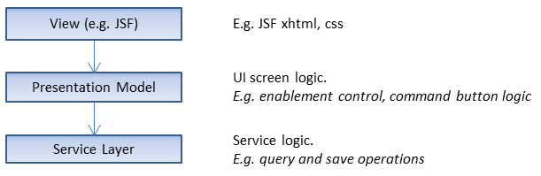

= pm4j =
:author: Olaf Boede
:doctype: book
:toc:
:lang: en
:encoding: iso-8859-1

ifdef::env-github[:outfilesuffix: .adoc]

pm4j is a framework that allows writing maintainable Java UI applications efficiently.

pm4j supports the implementation of presentation models as described by Martin Fowler (see: http://www.martinfowler.com/eaaDev/PresentationModel.html). 

Applications using the Presentation Model (PM) pattern use implementation layers as shown in the following picture. 

Each layer knows only the layer below and knows nothing about the layer it gets used by. +
That's a structural advantage compared to other UI patterns such as MVC or MVP. +
Main advantages are maintainability, testability and view technology independence. See chapter link:2_Goals{outfilesuffix}[pm4j Goals] for more details.

But there are also challenges for applications using the PM approach:

- Synchronization between the view and PM layer (view binding)

__Imagine a form having 10 input controls. +
That form would require on the PM side to have more than 100 getters for all the UI aspects 
(title, tool tip, icon, visibility, enablement, value, options etc.) of each control. +
On the view side you would also have to write more than 100 statements to read all details from the PM. +
Here its useful to use a PM framework that prevents writing such boiler plate code.__

- Synchronization and between PM's and service layer (bean data binding)

__In our form sample we assume that we have to read/write form data from/to a service layer bean. 
That would cause 20 statements (or methods) to transfer the 10 field values between the PM and bean.  +
A kind of data binding would be a nice PM framework feature to prevent such boiler plate code as well.__

pm4j provides standard implementations for these common challenges. +
It provides PM classes for a rich set of commonly used UI controls (input fields, command buttons, tables, trees etc.).

Applications using pm4j may concentrate on their domain specific UI logic. +
UI business logic code may be written clear and well structured. +
It must not be polluted with much technology or pattern related boiler plate code.
