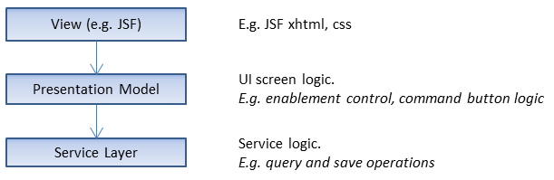

= pm4j Design Overview =
:author: Olaf Boede
:doctype: book
:toc:
:lang: en
:encoding: iso-8859-1

:toc:

== UI Application Layers ==

This chapter provides an overview about UI application layers and their responsibilities.

=== View Layer ===

The view layer defines where and how to display the UI controls.

Each control gets a link to its corresponding PM that provides the UI states for the view control (E.g. value, tooltip, enablement).

Example view code (here: a snippet of a JSF view): +

  <pm4j:inputText pm="#{form.name}" />

That code declares an input field and its binding to a corresponding PM. +
Some layout information may be added here as well. E.g. by placing __div__-elements or defining CCS styles using __styleClass="xyz"__. +
Please notice: There is no logic code for controlling visibility, enablement etc. in the view layer.

=== PM Layer ===

The PM layer contains Presentation Models for the view components. 

PMs are responsible for

* State information for various UI aspects (value, title, tooltip, options, enablement, visibility ...)
* UI logic. E.g.
** Operations to perform on a command button click.
** Operations to perform on a field value change.
** Calculated UI aspects. E.g. a field is only visible or enabled for specific users.

=== Service Layer ===

Provides domain objects and operations for retrieving and processing domain objects.

The PM layer usually uses dependency injection to access the required services.

