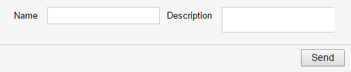

= pm4j Goals =
:author: Olaf Boede
:doctype: book
:toc:
:lang: en
:encoding: iso-8859-1

pm4j is intended to help writing UI applications having the following design properties:

- Maintainable UI code structure
- Loose coupled (even replaceable) view technology
- Good testability

The following text provide more details for these design goals.

== Maintainable UI code structure ==

View technology frameworks focus on providing technology specific UI controls. +
pm4j focuses on providing support for maintainable UI logic behind these view controls.

A pm4j application has for each view control a corresponding PM (presentation model). +
Thus each pm4j model has a 1:1 relation to the supported UI.

An example for that: +
A form having the fields _name_, _description_ and a _send_ button.

The corresponding PM has a similar structure: +
A PM class _MyFormPm_ having child PM's for _name_, _description_ and a command _cmdSend_.

[source]
class MyFormPm extends PmBeanImpl<MyBean> {
  public final PmAttrString name        = new PmAttrStringImpl(this);
  public final PmAttrString description = new PmAttrStringImpl(this);
  public final PmCommand    cmdSend     = new PmCommandImpl(this);
  ...
} 

The strict 1:1 relation between view controls and their UI logic models (PMs) minimizes the risk of getting unstructured UI logic code.

The following text explains that this maintainable structure will be preserved, even if the UI logic gets more complex.

=== UI logic for each control defined in one place === 

Each PM may be customized using annotations and by overriding some API methods.

An example: +
A command _cmdSend_ should trigger a validation of the entered values before sending the data. +
Additionally it should only be enabled if the field _name_ is filled.

[source]
  @PmCommandCfg(beforeDo=VALIDATE)
  PmCommand cmdSend = new PmCommandImpl(this) {
      @Override
      protected boolean isPmEnabledImpl() {   
          return name.getValue() != null;   
      }

All functionality related to _cmdSend_ functionality (regardless if its a fix annotation or an algorithm) is defined in one place. 

The UI logic code structure is uniform and predictable. +
There is no code distributed to other controllers, handlers or listeners. That helps keeping UI logic code maintainable.

=== Compact code ===

pm4j prevents repeated boiler plate code by supporting the following ideoms:

- Convention over configuration +
  __No code is required for default behaviour.__
- Annotations used to implement standard aspects +
  __One or two words needed for defining basic features like titles, caches etc.__  
- View binding +
  __Predefined view binding (e.g. xhtml tags) allow to implement and bind a view control for a PM using just a single line of code.__
- Data binding +
  __Bean data may be bound to PM's using no code (by convention) or using powerful expressions.__
- Support for standard Java bean validations +
  __Validations, coded once on bean level, is considered by PM's representing such beans.__
- Re-use of UI logic supported +
  __You may define domain specific PM modules (e.g. special tables, form parts...).__
  
=== Separation of UI logic and layout ===

pm4j helps to separate UI logic code and layout code strictly. +
UI logic is located in the PM layer. +
The view layer contains pure layout code. It defines where to place the controls and the required style information (e.g. CSS code).

That's an advantage for development teams having co-operating UI logic- and layout experts.

That clear separation helps to keep the UI logic code as well as the layout code maintainable.

== Loose coupled (replaceable) view technology ==

Since all UI logic is coded in PM's, the view layer code gets very small.

That makes it easier to update a view technology library to a new version. +
Also a switch to another view control library can be handled with limited effort, even for big projects.

Even a complete Java view technology switch may be handled, since the UI logic is view technology independent. +
The invested UI logic implementation effort is protected and may survive several view technology generations.

== Testability ==

The fact that all UI logic is located in Java classes and being independent from any view framework, makes it easy to provide simple JUnit tests.

Writing efficient UI logic tests is supported by several test tools (JUnit assertions and snapshot test). Please check the unit test related chapters.
