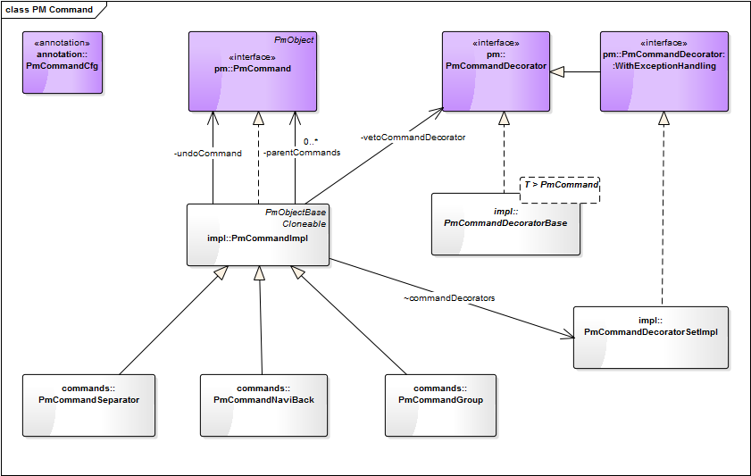

= PmCommand =
:author: TEBA Team
:doctype: book
:toc:
:lang: en
:encoding: iso-8859-1

== What is the feature used for ==

PmCommand is an interface to execute actions for e.g. buttons, links or menu entries.

== Usage of PmCommand objects ==

In this chapter we will describe how a framework user can add a new command element. An example for that will be the usage of a button command element.  

=== Adding a new PmCommand ===

To use a new command element you have to add the ui element (e.g. commandButton) into the xhtml file and corresponding PmCommand object into the related java implementation.

1. XHTML file:
[source]
<ui:define name="content">
	...
		<base:commandButton pm="#{pm.button}" />
	...
</ui:define>

1. Java class:
[source]
public final PmCommand button = new PmCommandImpl(this) {
};

=== Performing an action ===

To implement the necessary actions to execute you just have to override the doItImpl method.

[source]
@Override
protected void doItImpl() throws Exception {
};

Example for a simple action:

[source]
------------------------------------------------------------------------
@PmTitleCfg(title = "Save")
public final PmCommand add = new PmCommandImpl(this) {

    @Override
    protected void doItImpl() throws Exception { // Perform an action
        Person person = new Person();

        person.setFirstname(firstname.getValue());
        person.setLastname(lastname.getValue());

        persons.add(person);
    }
};
------------------------------------------------------------------------

=== Validation of a PM area ===

The validation of a command element is automatically called before executing the command. The default implementation of PMCommand 
triggers the validation of the parent element, whereat the parent is the first parent that implements the PmDataInput interface.
This means that the validation process validates the sub tree of this parent element, so that the attribute configuration 
(e.g. @PmAttrCfg(required = true)) and the implemented validation method of every element of the sub tree are executed. 
After validating the parent element the validation process checks if there are any error messages. 

If the developer wants to have a different kind of validation he just has to override the validate method of PmCommand.

[source] 
@Override
protected boolean validate() {
    // some specific validation
    ...
}

To implement some specific validation rules for an element of the subtree the developer just has override the validation method of that element (e.g. PmAttrString).

[source]
------------------------------------------------------------------------
@PmAttrCfg(required = true)
public final PmAttrString myAttribute = new PmAttrStringImpl(this) {

    @Override
    protected void validate(String value) throws PmValidationException {
        super.validate(value);

        // more validation actions
        ...
    }
};
------------------------------------------------------------------------

NOTE: Be careful: Do not forget to call the super implementation of validate. Otherwise you will get a completely independent validation implementation. 
This means that you will loose all inherited validation actions like checking configured annotations (e.g. @PmAttrCfg). 

=== Configuration of PmCommandCfg annotation ===

With the PmCommandCfg you have the possibility to change the default behaviour of the PmCommand object. This means that you can configure for example 
the behaviour before or after executing the command.

==== BeforeDo ====

The beforeDo paramter defines what should be done before executing the command logic, whereat the following actions are possible:

* VALIDATE: This call validates the entered data of the containing PmDataInput objects (see Validation of a PM area [HIER LINK SETZEN!]). The doItImpl method of the command 
will only be executed if the validation was successful.
* CLEAR: Clears all messages within the current PmConversation. Additionally entered string values that have failed to convert to the corresponding attribute value type 
will also be cleared. The doItImpl method of the command will be executed regardless if there are errors within the related PmConversation or not.
* DO_NOTHING: Does not care about existing (error-) messages and does not clear any of these messages before it gets executed.
* DEFAULT: The definition, defined in the project specific PmDefaults will be used. The default implementation is VALIDATE.

==== AfterDo ====

The afterDo parameter defines what should be done after executing the command logic, whereat the following actions are possible:

* RESET_VALUE_CHANGED_STATE: Resets the value change state of the pm that is used as validation root.
* CLEAR_CACHES: Clears the caches of all pm's along the path to the root pm. 
* DO_NOTHING: Does not executes any special operation in the after do method of the command.
* DEFAULT: The default logic is to execute CLEAR_CACHES and if VALIDATE is set for the beforeDo action also RESET_VALUE_CHANGED_STATE.

==== CmdKind ====

The default value is COMMAND.

* COMMAND: Commands that are in general executeable. An executeable command may also have subcommands provided by getSubCommandList of PmCommand. 
This way an executeable command may also act as command group.
* GROUP: A pure organizational structure of commands.
* SEPARATOR: A separator between command sections of a command list.

==== HideWhenNotEnabled ====

* If true, the command should be hidden when not applicable. The default value is false.

==== ClearCaches ====

*  Defines the caches to clear within the element context of this command. The default value is an empty array, which means that there is nothing to clear.

=== Navigate to another view ===

To navigate to another view you can use the HotLinkCommandPm. Here you have to override the getNaviLinkImpl to return a NaviLink object, 
that contains the information about the target to navigate to. Optional it is also possible to add some parameters.

[source]
------------------------------------------------------------------------
@PmTitleCfg(title = "Show All")
public final PmCommand cmdShowAll = new HotLinkCommandPm(this) {

    @Override
    protected NaviLink getNaviLinkImpl() {
        // Path to the requested component
        NaviLinkImpl naviLink = new NaviLinkImpl( "/page/someDialog.iface" );
        
        naviLink.addParam("name", "value");
        // ... more parameter ...

        return naviLink;
    }
};
------------------------------------------------------------------------

You can read these parameter in the target object like this:

[source]
@Override
    protected void afterDialogInitialization() {
        String value = Jsf2Util.readRequestParameter("name");
		... more parameter ...
    }
}

=== Success message ===

After executing your action, it is possible to present the user a success message. This could happen via two different ways:

* By implementing a success message via PmMessageApi in the doItImpl method of your PmCmmand object.

[source]
------------------------------------------------------------------------
@Override
protected void doItImpl() throws Exception {
    ...
    PmMessageApi.addMessage(this, Severity.INFO, "message.key", value1, value2);
}
------------------------------------------------------------------------

Then you also have to add a message for your message key into the related resource file.
[source]
message.key={0} successfully done in {1}.

* By defining a string resource having the postfix _successInfo.
[source]
cmdDoSomething=Do Something
cmdDoSomething_successInfo=Something was successfully done.

Example:
  cmdDoSomething=Do Something
  cmdDoSomething_successInfo=Something was successfully done.

=== Testing commands ===

It quite easy to test the implemented functionality of a PmCommand object. To do so you have to create a test conversation for the view that contains your command, first (1).
Then you can test the implementation of the PMCommand by calling the doIt method (2). To check, if the execution of doIt was successful or not you can validate the CommandState 
of the PmCommand cmd, now. In our first test the execution should be successful, so the CommandState should be EXECUTED (3).

When calling the doIt method, it first validates the command like it is descriped in "Validation of a PM area" [HIER LINK SETZEN!]. So it is sometimes required to initialize all 
the attributes of the parent of your command to prevent a validation error, first (4). But if you want to check that the validation also works fine, you only have to call the doIt method 
without initializing the view attributes. Then you will not receive an EXECUTED command state, but a BEFORE_DO_RETURNED_FALSE command state (5). When getting such a validation error,
you are also able to check the content of the validation messages, so that you can verify that the validation works correct (6).

[source]
------------------------------------------------------------------------
public class MyViewPmTest {

    private MyViewPm view = new MyViewPm();

    @Before
    public void setUp() {
        AppDlgAssert.initTestPm(view);                                     (1)
    }
	
	public void testMyCommand() {
        cmd.myAttribute.setValue("My Value");                              (4)
	
        PmCommand cmd = (PmCommandImpl) view.myCommand.doIt();             (2)
		
		CommandState commandState = cmd.getCommandState();
        assertEquals(CommandState.EXECUTED, commandState);                 (3)
		
		...
    }
	
	public void testShouldFail() {
	    PmCommand cmd = (PmCommandImpl) view.myCommand.doIt();
		
        CommandState commandState = cmd.getCommandState();
        assertEquals(CommandState.BEFORE_DO_RETURNED_FALSE, commandState); (5)

        // Validation messages
        List<PmMessage> validationScopeErrors = 
            PmMessageApi.getPmTreeMessages(dialog, Severity.ERROR);        (6)
        ...
    }
}
------------------------------------------------------------------------

== Implementation of PmCommand in pm4j ==

=== Class model ===

