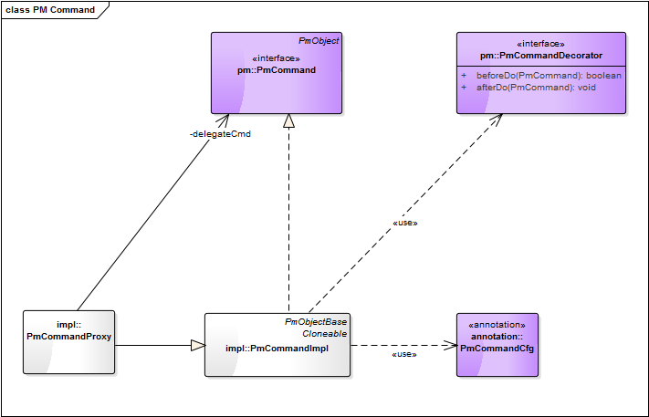

= PmCommand =
:author: TEBA Team
:doctype: book
:toc:
:lang: en
:encoding: iso-8859-1

== Purpose of the component ==

PmCommand models support UI logic for view components triggering actions. E.g. buttons, links or menu entries.

== Usage of PmCommand objects ==

=== Relevant classes and interfaces ===

==== Core interfaces and classes ====

* _PmCommand_ - external interface for views
* _PmCommandImpl_ - a basic command logic implementation

==== Specialized command classes ====

* _PmCommandDecorator_ - interface for command execution interceptors
* _PmCommandProxy_ - fix commands that may delegate requests to a registered executing command. +
  Example use case: A fix toolbars that delegating calls to actual context specific real commands.
  

== PmCommand usage ==

In this chapter we will describe how a framework user can add a new command element. An example for that will be the usage of a button command element.  

=== Adding a new PmCommand ===

To use a new command element you have to add the ui element (e.g. commandButton) into the xhtml file and corresponding PmCommand object into the related java implementation.

1. Java code:
[source]
public final PmCommand cmdSave = new PmCommandImpl(this);

1. View (e.g. JSF)
[source]
<pmtags:commandButton pm="#{pm.cmdSave}" />

=== Defining an action ===

To implement the necessary actions to execute you just have to override the _doItImpl()_ method.

[source]
@Override
protected void doItImpl() {
  // ... some UI logic code
}

=== BeforeDo and afterDo logic ===

It's often useful to define precondition checks or follow-up operations for commands.

The following options exist for defining before/after operations:

- For standard cases you may configure _@PmCommandCfg(beforeDo=..., afterDo=...)_.
- You may override _beforeDo()_ and _afterDo()_ for more domain specific logic.
- For reusable or attachable before/after logic a _PmCommandDecorator_ may be used.

=== _@PmCommandCfg_ ===

...allows defining some standard command behaviour.

==== beforeDo ====

The _beforeDo_ parameter defines what should be done before executing the command logic, whereat the following actions are possible:

* _VALIDATE_:

Performs a validation of the next parent PM not being of type _PmCommand_.

The method _doItImpl()_ will only be executed if the _PmConversation_ has no error messages after that validation.
(see Validation of a PM area [HIER LINK SETZEN!]). 

* _CLEAR_: Clears all messages within the current _PmConversation_. Additionally entered string values that have failed to convert to the corresponding attribute value type 
will also be cleared. The doItImpl method of the command will be executed regardless if there are errors within the related PmConversation or not.

* _DO_NOTHING_: Does not care about existing (error-) messages and does not clear any of these messages before it gets executed.

* _DEFAULT_: The definition, defined in the project specific PmDefaults will be used. The default implementation is VALIDATE.

==== afterDo ====

The _afterDo_ parameter defines what should be done after executing the command logic, whereat the following actions are possible:

* RESET_VALUE_CHANGED_STATE: Resets the value change state of the pm that is used as validation root.
* CLEAR_CACHES: Clears the caches of all pm's along the path to the root pm. 
* DO_NOTHING: Does not executes any special operation in the after do method of the command.
* DEFAULT: The default logic is to execute CLEAR_CACHES and if VALIDATE is set for the beforeDo action also RESET_VALUE_CHANGED_STATE.

==== cmdKind ====

The various roles of a commands in toolbars and command menus are supported by a CmdKind enum indicator.  

The default value is COMMAND.

* COMMAND: Commands that are in general executeable. An executeable command may also have subcommands provided by getSubCommandList of PmCommand. 
This way an executeable command may also act as command group.
* GROUP: A pure organizational structure of commands.
* SEPARATOR: A separator between command sections of a command list.

==== clearCaches ====

*  Defines the caches to clear within the element context of this command. The default value is an empty array, which means that there is nothing to clear.

=== Navigate to another page ===

It is possible to navigate to another page via NaviLink in a static or in a dynamic way.

==== Static navigation ====
* You can navigate to a page directly.
[source]
------------------------------------------------------------------------
public final PmCommand cmdNavigateToFixTarget = new PmCommandImpl(this, 
	new NaviLinkImpl("/page/someDialog.iface"));
------------------------------------------------------------------------
* You also can override the getNaviLinkImpl method of a PmCommand.
[source]
------------------------------------------------------------------------
public final PmCommand cmdNavigateToCalculatedTarget = new PmCommandImpl(this);

    @Override
    protected NaviLink getNaviLinkImpl() {
		String page = someCondition() ? "targetPage1" : "targetPage2";
		
        // Path to the requested component
        NaviLinkImpl naviLink = new NaviLinkImpl(page);
        
        naviLink.addParam("name", "value");
        // ... more parameter ...
        return naviLink;
    }
};
------------------------------------------------------------------------

==== Dynamic navigation ====

* You can navigate to another page by implementing the navigation logic in the doItImpl method.
[source]
------------------------------------------------------------------------
public final PmCommand cmdThatOnlySometimesNavigates = new PmCommandImpl(this);

    @Override
    protected void doItImpl() {
        // .. some logic
		if (verySpecialCondition()) {
		   setNaviLink(new NaviLinkImpl("specialConditionHandlingPage");
		}
    }
};
------------------------------------------------------------------------

=== Success message ===

After executing your action, it is possible to present the user a success message. This could happen via two different ways:

* By implementing a success message via PmMessageApi in the doItImpl method of your PmCmmand object.

[source]
------------------------------------------------------------------------
@Override
protected void doItImpl() throws Exception {
    ...
    PmMessageApi.addMessage(this, Severity.INFO, "message.key", value1, value2);
}
------------------------------------------------------------------------

Then you also have to add a message for your message key into the related resource file.
[source]
message.key={0} successfully done in {1}.

* By defining a string resource having the postfix _successInfo.
[source]
cmdDoSomething=Do Something
cmdDoSomething_successInfo=Something was successfully done.

Example:
  cmdDoSomething=Do Something
  cmdDoSomething_successInfo=Something was successfully done.

=== Testing commands ===

It is quite easy to test the implemented functionality of a PmCommand object. To do so you only have to call the doIt method of the PmCommand 
by using the PmAssert class. If you have to do some other special actions (like setting values or checking the returned message) you can also 
do this via using PmAssert.

[source]
------------------------------------------------------------------------
public class MyFormPmTest {

	private MyFormPm form = new MyFormPm();

	public void testSaveValidValues() {
		PmAssert.setValue(form.requiredAttr, "My Value");
		PmAssert.doIt(form.cmdSave);
    }
	
	public void testSaveWithoutRequiredValueShouldFail() {
		PmAssert.doIt(form.cmdSave, CommandState.FAILED);
		PmAssert.assertMessage(
			form, Severity.ERROR, "Please enter a valid value in 'required attr'");
    }
}
------------------------------------------------------------------------

